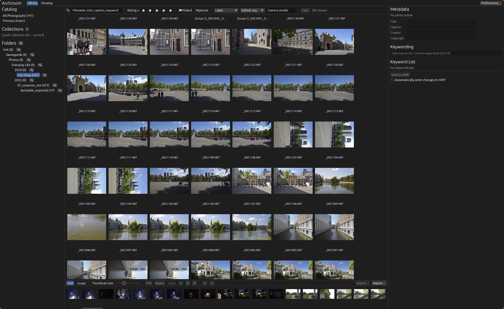
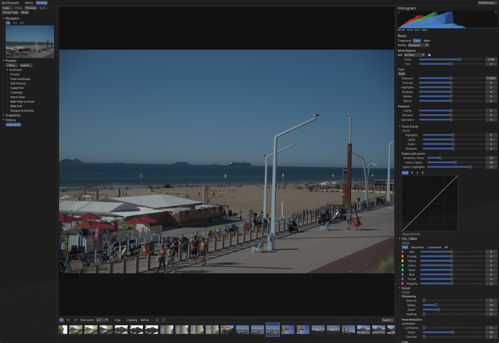
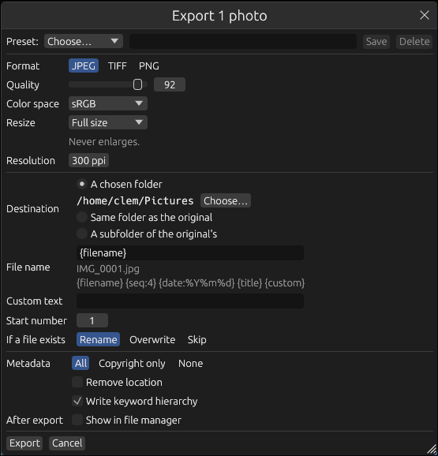

<div align="center">

# Viberoom

**A Linux-native, non-destructive photo library and raw developer.**

*A darkroom with the lights on, built on Arch.*

Catalog thousands of photos, cull them from the keyboard, and develop raws on the GPU, without ever touching your originals.

[](LICENSE)


</div>

> [!NOTE]
> Viberoom is **pre-release (v0.2.0)**. Import, organizing, Develop (including local adjustments) and Export work. Expect rough edges: keep your originals backed up (Viberoom never modifies them) and see [Status](#status).

## Screenshots


*Library: browse, filter and cull a catalog from the grid.*


*Develop: non-destructive raw editing with presets, history, histogram and the full set of panels.*

## Why Viberoom

Linux has excellent raw tools, but few that pair a fast catalog with a develop workflow you already know. Viberoom is a Library and Develop pair with a filmstrip, panels and sliders, driven from the keyboard.

If you've ever spent an evening in a well-known room full of light, your fingers will find their way around here: the panel order, the slider names and the shortcuts will feel familiar. Everything else is new, open source, and yours.

- **Non-destructive.** Originals are opened read-only. Edits are stored as parameters in the catalog, so every edit can be undone or changed later. Removing a photo never deletes a file: it either leaves the catalog (file untouched) or goes to the system trash, and both can be undone.
- **GPU-first.** Development runs on a scene-referred, linear-light float pipeline in WGSL compute shaders (via `wgpu`/Vulkan). Sliders re-render in well under a millisecond on a modern GPU.
- **Built for large catalogs.** The Grid is virtualized, work runs as background jobs, and the UI never waits on decoding or disk.
- **Plays well with others.** Ratings, labels and keywords are written to standard XMP sidecars that darktable and digiKam can read.
- **Wayland and X11.** Native on both. Nothing here is tied to one compositor.

## Features

### Library
- Import from a folder (add in place, or copy), skipping duplicates, with progress and cancel
- Raw (via LibRaw), JPEG, PNG and TIFF, with embedded ICC profile handling
- Virtualized Grid, Loupe and filmstrip, plus a folder tree
- Ratings, flags and color labels, with undo/redo for every change
- Virtual copies, each with its own edits and thumbnail
- Hierarchical keywords with autocomplete, plus batch metadata editing
- Collections, collection sets, Quick Collection and smart collections
- Filter bar with full-text search, and a Missing filter
- XMP sidecar read/write that preserves fields written by other apps
- **Remove or trash, safely.** `Delete` opens a confirmation with two choices: *Remove from Catalog* (the file stays where it is) or *Move to Trash* (the original and its sidecar go to the system trash). Cancel is the default, both choices undo with `Ctrl+Z` (a trashed file is restored from the trash), and there is no permanent delete. A file still used by another photo, such as a virtual copy you did not select, is never trashed. If the move fails, nothing changes
- **Missing files.** Originals that vanish from disk (a drive unplugged, a folder renamed) are flagged in the background at startup and when you open a folder. They get a ⚠ badge in the Grid, filmstrip and folder tree, a banner with **Locate…** to relink the file (it warns when the type, size or contents differ, and can relink the rest of the folder too), and a Missing filter. Edits are never lost, and a file that comes back clears its own flag

### Export
- JPEG, TIFF (8/16-bit; none, LZW or ZIP) and PNG (8/16-bit), with the ICC profile embedded
- sRGB, Display P3, Adobe RGB and ProPhoto output, full-resolution 16-bit render on the GPU
- Resize by long edge, short edge, box, megapixels or percent (never enlarges)
- File-name templates (`{filename}`, `{seq:4}`, `{date:%Y%m%d}`, `{title}`, `{custom}`), rename/overwrite/skip on conflict
- Metadata: everything, copyright only, or none; optional location removal; keyword hierarchy
- Presets, and a background batch with progress and cancel while you keep working
- `viberoom-cli export` does the same without the UI

<p align="center">
  
</p>

### Develop
- White balance, exposure, contrast, highlights, shadows, whites and blacks
- Tone curve (parametric and point), HSL and B&W mixer
- Clarity, sharpening, and luminance and color noise reduction
- Crop and straighten, with overlays; drag outside a corner of the crop box to rotate the image under the box, and double-click inside the box to apply
- Local adjustments, each with Exposure, Contrast, Highlights, Shadows, Whites and Blacks: **linear gradients** (move, rotate, feather, flip) and **brush zones** (size, feather and flow, erase, mouse-wheel size, mask overlay), up to 16 per photo
- **Red eye and pet eye** correction (white, green or yellow glow), with darken and an optional catchlight
- Vignette
- Histogram, clipping display, before/after, eyedropper, Auto Tone and Auto WB
- Persistent history, copy/paste settings, and presets (with `.arpreset` import/export)
- Navigator with zoom (Fit, 1:1, 2:1, 3:1, 5:1 and a click-zoom picker)

### Preferences
- Interface size (scales the whole UI), canvas background, preview size and quality, preview cache budget, daily catalog backups and XMP auto-write

## Keyboard shortcuts

| Key | Action |
|---|---|
| `0`–`5` | Set rating |
| `6`–`9` | Set color label |
| `P` / `X` / `U` | Pick / Reject / Unflag |
| `B` | Add to Quick Collection |
| `Ctrl+K` | Focus keyword entry |
| `Ctrl+[` / `Ctrl+]` | Rotate left / right |
| `Ctrl+'` | Create a virtual copy |
| `Delete` / `Backspace` | Remove from catalog or move to trash (asks first) |
| `Ctrl+S` | Write XMP sidecars |
| `Ctrl+Shift+E` | Export the selection |
| `Ctrl+Alt+Shift+E` | Export again with the last settings |
| `Ctrl+,` | Preferences |
| `Ctrl+Z` / `Ctrl+Y` | Undo / Redo |
| `Ctrl+A` / `Ctrl+D` | Select all / none |
| `←` / `→` | Previous / next photo |
| `Tab` / `Shift+Tab` | Toggle side panels / all panels |
| `J` | Show clipping (Develop) |
| `W` | White balance eyedropper (Develop) |
| `V` | Switch color / B&W (Develop) |
| `\` | Before / after (Develop) |
| `R` | Crop & straighten (Develop) |
| `Shift+R` | Red eye / pet eye (Develop) |
| `M` / `K` | Gradient / brush zone (Develop) |
| `Enter` / `Esc` | Apply / cancel the open tool (Develop) |
| `O` | Cycle crop overlay, or show the mask of a gradient or brush zone (Develop) |
| `'` | Flip the selected gradient (Develop) |
| `[` / `]`, `Shift+[` / `Shift+]` | Brush size, feather; the mouse wheel also changes the size, and `Alt` paints as erase (Develop) |
| `Ctrl+Shift+C` / `Ctrl+Shift+V` | Copy / paste settings (Develop) |

## Building

Viberoom is a Rust workspace. You need a recent stable Rust toolchain (1.85 or newer) and a few system libraries.

### System dependencies

| Library | Why |
|---|---|
| `libraw` (≥ 0.20; 0.22 recommended) | Raw decoding |
| `lcms2` | Color management |
| `exiv2` / `gexiv2` | Metadata |
| `clang` / libclang | Generating the LibRaw bindings |
| A Vulkan loader and driver | GPU rendering (Mesa's `lavapipe` works as a software fallback) |

**Arch Linux**

```sh
sudo pacman -S --needed rust libraw lcms2 exiv2 libgexiv2 clang \
    vulkan-icd-loader vulkan-radeon vulkan-intel vulkan-swrast
```

Other distributions need the equivalent development packages (for example `libraw-dev`, `liblcms2-dev`, `libgexiv2-dev` and `libclang-dev` on Debian/Ubuntu). Packaging for more distros is [planned](#roadmap).

### Install from a release

Each [release](https://github.com/GlemNL/viberoom/releases) ships:

| Format | For |
|---|---|
| `.AppImage` | Any x86_64 distribution (bundles LibRaw, lcms2 and gexiv2) |
| `.deb` (`ubuntu22.04`, `ubuntu24.04`) | Ubuntu and derivatives; pick the one matching your release |
| `.rpm` | Fedora |
| `.pkg.tar.zst` | Arch Linux (`sudo pacman -U`) |
| `SHA256SUMS` | Checksums for all of the above |

All of them need a working Vulkan driver on the host.

### Build the Arch package from source

`packaging/PKGBUILD` builds the package from a release tag:

```sh
cd packaging && makepkg -si
```

### Run

```sh
git clone https://github.com/GlemNL/viberoom
cd viberoom
cargo run --release -p viberoom-app
```

If you have [`just`](https://github.com/casey/just), `just run` does the same.

### Develop

```sh
just test    # all tests
just lint    # rustfmt, clippy (warnings denied), dependency-rule check
just deny    # license and advisory check (needs cargo-deny)
just bless   # re-bless golden images after an intentional rendering change
```

The workspace is split so that the engine, catalog, jobs and services crates never depend on the UI toolkit. A headless CLI uses them too:

```sh
cargo run -p viberoom-cli -- render --help
```

It also covers catalog housekeeping: `viberoom-cli catalog list|check-missing|remove|trash`. `remove` and `trash` only print what they would do unless you pass `--yes`.

## Where things live

| What | Where |
|---|---|
| Config | `~/.config/viberoom/config.toml` |
| Presets | `~/.local/share/viberoom/presets/` |
| Catalog | `~/Pictures/Viberoom/Viberoom.arcat` (SQLite) |
| Previews | Next to the catalog, in `Viberoom Previews/` (trimmed to the cache budget at startup) |
| Backups | Next to the catalog, in `Viberoom Backups/` (daily, newest few kept) |
| Caches | `~/.cache/viberoom/` (safe to delete) |
| Logs | `~/.local/state/viberoom/logs/` |

## Architecture

```
crates/
  core/            ids, settings, events, errors
  color/           color math, chromatic adaptation, lcms2 wrapper
  libraw-sys/      LibRaw bindings
  io/              decoders, metadata, XMP
  catalog/         SQLite schema, queries, undoable commands
  jobs/            priority scheduler with cancellation
  engine/          GPU pipeline, ops and WGSL shaders
  preview/         thumbnail and preview cache
  services/        import, presets, develop sessions
  ui-kit/          shared egui widgets and theme
  module-library/  Library module
  module-develop/  Develop module
  shell/, app/     window, module switcher, the `viberoom` binary
  cli/             headless `viberoom-cli`
```

Design decisions are recorded as ADRs in [`docs/adr/`](docs/adr).

## Status

| Milestone | State |
|---|---|
| M0 Foundations | Done |
| M1 Import and browse | Done |
| M2 Organize | Done (remove, trash and missing-file handling are built; the dialogs are awaiting a final click-through) |
| M3 Develop foundation | Done |
| M4 Develop tools | Done, apart from the image-quality tuning pass |
| M5 Export and v0.1 release | Export, backups, Preferences and packaging done; performance and the release checklist pending |
| v0.2.0 | Done: red eye and pet eye, gradients, brush zones, crop rotation, remove/trash/missing files. Moved to the next release: lens corrections, spot removal, monitor ICC profiles, and tuning the local whites/blacks/contrast against a reference |

## Roadmap

- Own GPU demosaic (a full-size export of a 24 MP raw is bound by LibRaw's ~1.1 s CPU decode), 1:1 preview cache
- Flatpak (after the AUR package)
- Planned next: lens corrections (lensfun distortion, vignetting, chromatic aberration), spot removal (clone and heal) and monitor ICC profiles, so the screen matches your calibrated display
- After that: radial gradients and range masks, soft proofing

## Contributing

Issues and pull requests are welcome. Please run `just lint` and `just test` before opening a PR. For rendering changes, review any golden-image diffs by eye before blessing them.

## License

Viberoom is licensed under the [GPL-3.0-or-later](LICENSE).

Viberoom is an independent project. It is not affiliated with or endorsed by Adobe. Lightroom is a trademark of Adobe Inc.
